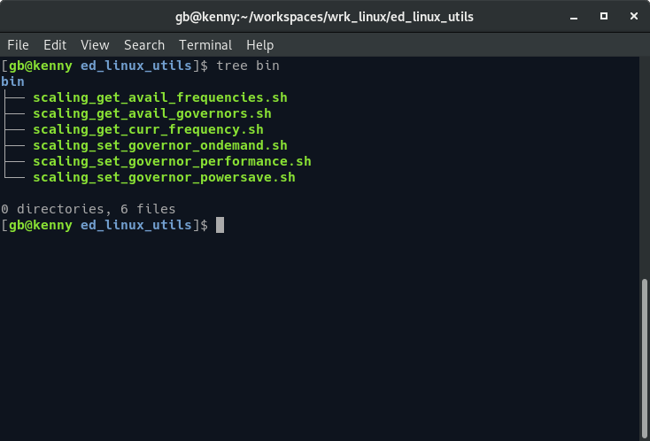

# Linux Utilities

This package contains a set of utilities for use with the Linux operating system.


# License

This project is licensed under the 
[MIT](https://tldrlegal.com/license/mit-license) License.


# Scripts

The following scripts are located in the `bin` directory:



List the available scaling frequencies for all of the CPU's in the system.
```sh
scaling_get_avail_frequencies.sh
```

List the available frequency scaling governors for all of the CPU's in the system.
```sh
scaling_get_avail_governors.sh
```

List the current frequencies for all of the CPU's in the system.
```sh
scaling_get_curr_frequency.sh
```

Set the frequency scaling governors for all of the CPU's to `ondemand` so that 
the frequency of the CPU's is changed dynamical according to current load.
```sh
scaling_set_governor_ondemand.sh
```

Set the frequency scaling governors for all of the CPU's to `performance` so that 
the CPU's run at the maximum frequency.
```sh
scaling_set_governor_performance.sh
```

Set the frequency scaling governors for all of the CPU's to `powersave` so that 
the CPU's run at the minimum frequency.
```sh
scaling_set_governor_powersave.sh
```
